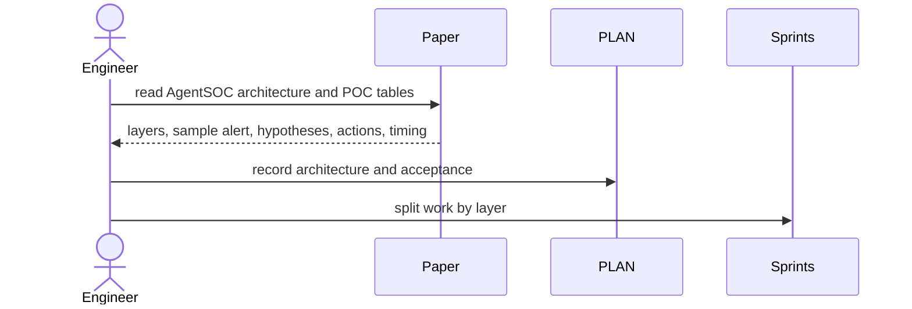

# S00 Paper Reverse Engineering

## Goal

Extract the implementation contract from `agent_soc.pdf` and freeze the POC target before coding.

## SSD

## Input

- `AGENT-SOC/agent_soc.pdf`
- Official arXiv HTML for cross-checking: `https://arxiv.org/html/2604.20134v1`
- User constraints: dry-run actions, OpenAI small-call budget, sprint docs in `sprints/`.

## Output

- `PLAN.md` with pipeline, env gate, public interfaces, test commands.
- Sprint specs `S00` through `S09`.
- POC acceptance facts:
  `INC-POC-001`, `H1/H2/H3`, SSE accepted/conditional/rejected, top action score `0.599`.

## Code Tasks

- No runtime code in this sprint.
- Define contracts and safety boundaries for later sprints.

## Test Cases

- Documentation review: all later sprint files reference the same POC facts.
- No implementation file depends on real SOC connectors.

## Stress Test

- Not applicable. This sprint is analysis only.

## Acceptance

- Implementation can be handed to another engineer without deciding architecture again.
- High-volume tests are explicitly mock-only.
- Real OpenAI calls are limited to small NCE tests/runs under budget.

## Env Needed

- none
