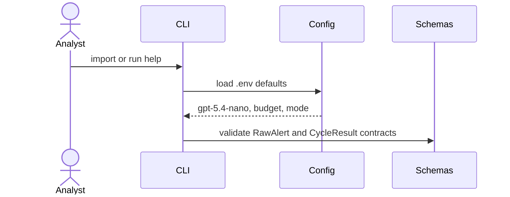

# S01 Scaffold Contracts

## Goal

Create the Python package, env contract, CLI shell, and Pydantic schemas used by all later layers.

## SSD

## Input

- `pyproject.toml`
- `.env.example`
- `fixtures/paper_alert.json`

## Output

- Importable package `agent_soc`.
- CLI module `agent_soc.cli`.
- Schemas: `RawAlert`, `Incident`, `AttackHypothesis`, `FeasibilityResult`,
  `DefensiveAction`, `RankedAction`, `Playbook`, `ExecutionRecord`,
  `MonitoringResult`, `CycleResult`.

## Code Tasks

- Add project metadata and pytest config.
- Add `.env.example` with OpenAI and guard settings.
- Implement config defaults:
  `AGENTSOC_LLM_MODEL=gpt-5.4-nano`,
  `AGENTSOC_MAX_LLM_CALLS=30`,
  `AGENTSOC_ALLOW_STRESS_LLM=false`.
- Add import smoke tests and schema validation tests.

## Test Cases

- All core modules import.
- `.env.example` contains every required env key.
- `RawAlert` parses ISO timestamp.
- Settings default to `gpt-5.4-nano`.

## Stress Test

- None. Scaffold must not call OpenAI or external systems.

## Acceptance

- `pytest -m "not llm and not stress"` includes scaffold tests.
- Missing `OPENAI_API_KEY` does not fail deterministic tests.

## Env Needed

- none
