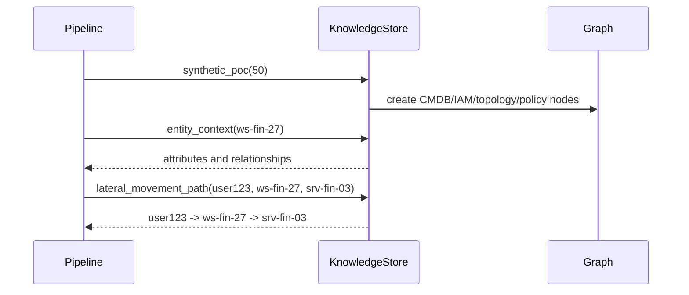

# S02 Knowledge Store Graph

## Goal

Build the synthetic enterprise knowledge store used by Perception, SSE, and RSEM.

## SSD

## Input

- Synthetic POC entities:
  `user123`, `ws-fin-27`, `srv-fin-03`, `domain-controller-01`,
  `finance_group`, `kerberos`, policy and baseline nodes.

## Output

- `EnterpriseKnowledgeStore.synthetic_poc(node_count=50)`.
- JSON save/load support for custom graph fixtures.
- Entity context and path lookup APIs.

## Code Tasks

- Implement NetworkX directed graph.
- Add node attributes for user, host, group, service, network, policy, rule, artifact, baseline.
- Add edges for `USES`, `CAN_CONNECT`, `AUTHENTICATES_TO`, `MEMBER_OF`, `CAN_ACCESS`.
- Add policy guard declaring live destructive actions blocked.

## Test Cases

- Synthetic graph has exactly 50 nodes.
- POC nodes exist.
- `ws-fin-27` context includes `CAN_CONNECT:srv-fin-03`.
- Lateral path returns `user123 -> ws-fin-27 -> srv-fin-03`.
- Save/load roundtrip preserves graph behavior.

## Stress Test

- Later stress extends node count to 500/5,000 with mock-only execution.

## Acceptance

- Store supports all graph facts needed for paper POC.
- Store has no connector to real CMDB/IAM/SIEM.

## Env Needed

- none
