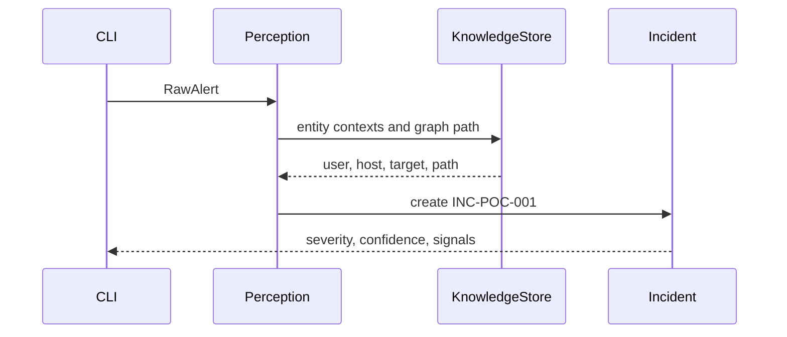

# S03 Perception Layer

## Goal

Normalize and enrich raw alerts into AgentSOC incidents.

## SSD

## Input

- `fixtures/paper_alert.json`
- `EnterpriseKnowledgeStore.synthetic_poc()`

## Output

- `Incident` with:
  `incident_id=INC-POC-001`,
  severity `high`,
  signals `kerberos_tgt_activity`, `successful_authentication`, `critical_target`,
  `reachable_target_path`.

## Code Tasks

- Normalize event strings.
- Add deterministic POC incident ID.
- Enrich source user, source host, target host.
- Add dedupe for duplicate alert bursts.

## Test Cases

- Paper alert enriches to `INC-POC-001`.
- Contexts include `user123`, `ws-fin-27`, `srv-fin-03`.
- Duplicate alert with different event id dedupes to one logical alert.

## Stress Test

- Duplicate bursts are handled by deterministic key.
- Malformed input is rejected by `RawAlert` schema before enrichment.

## Acceptance

- Perception is deterministic and offline.
- No LLM/API call happens in this layer.

## Env Needed

- none
