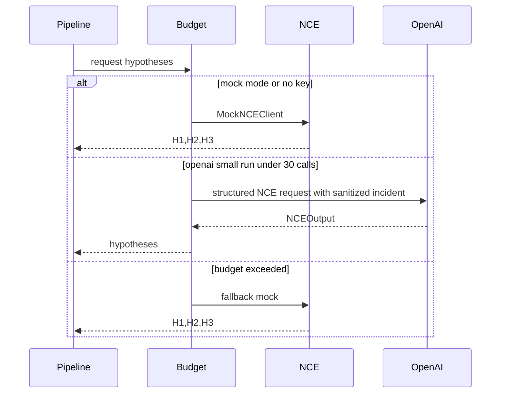

# S04 NCE Layer

## Goal

Implement Narrative Construction Engine with deterministic mock and gated OpenAI mode.

## SSD

## Input

- `Incident`
- Env:
  `OPENAI_API_KEY` optional,
  `AGENTSOC_LLM_MODEL=gpt-5.4-nano`,
  `AGENTSOC_MAX_LLM_CALLS=30`.

## Output

- `NCEOutput` with exactly three `AttackHypothesis` items for the mock POC:
  `H1`, `H2`, `H3`.

## Code Tasks

- Implement `MockNCEClient`.
- Implement `OpenAINCEClient` using structured Pydantic parse.
- Implement `BudgetedNCEClient`.
- Implement `create_nce_client`:
  `mock` always mock, `openai` requires key, `auto` uses OpenAI only when key exists.

## Test Cases

- Mock returns `H1/H2/H3`.
- Auto without key chooses mock.
- LLM marker test uses `gpt-5.4-nano`, skips without `OPENAI_API_KEY`.
- Calls stay under `AGENTSOC_MAX_LLM_CALLS`.

## Stress Test

- Stress/benchmark must not use OpenAI unless explicitly allowed and under budget.
- Retry storms are not implemented for OpenAI in POC; failures surface or fallback according to mode.

## Acceptance

- Default test suite never calls OpenAI.
- Small `pytest -m llm` can call OpenAI only after the user provides `OPENAI_API_KEY`.

## Env Needed

- `OPENAI_API_KEY` only for real OpenAI tests/runs.
