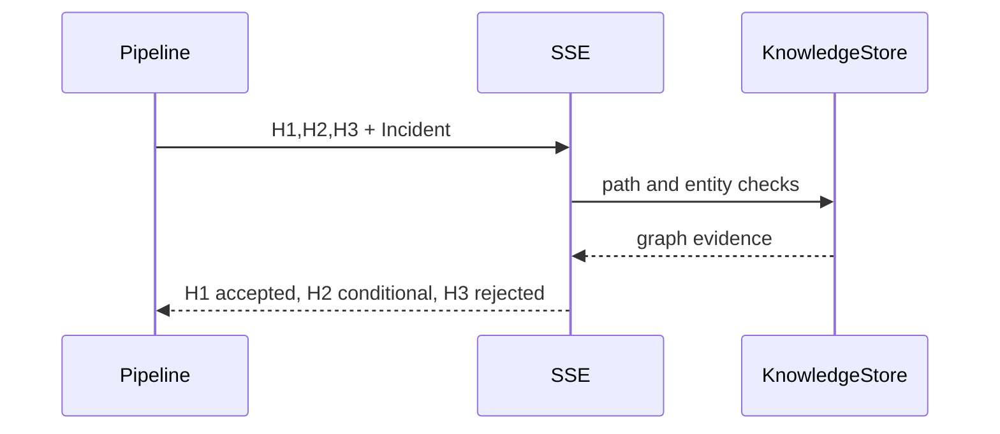

# S05 SSE Layer

## Goal

Validate hypotheses against graph semantics and policy context.

## SSD

## Input

- Incident from Perception.
- Hypotheses from NCE.
- Knowledge store graph.

## Output

- `FeasibilityResult` list:
  `H1 accepted`,
  `H2 conditional`,
  `H3 rejected`.

## Code Tasks

- Check required entities exist.
- Confirm lateral movement path for `H1`.
- Mark `H2` conditional due to partial baseline dependency.
- Reject `H3` due to missing `external_ip`.

## Test Cases

- Paper hypotheses produce exact statuses.
- Rejected result contains reason.
- Accepted result contains graph path.

## Stress Test

- Large graph path checks run with mock hypotheses only.

## Acceptance

- SSE can explain every accept/conditional/reject decision in artifacts.

## Env Needed

- none
