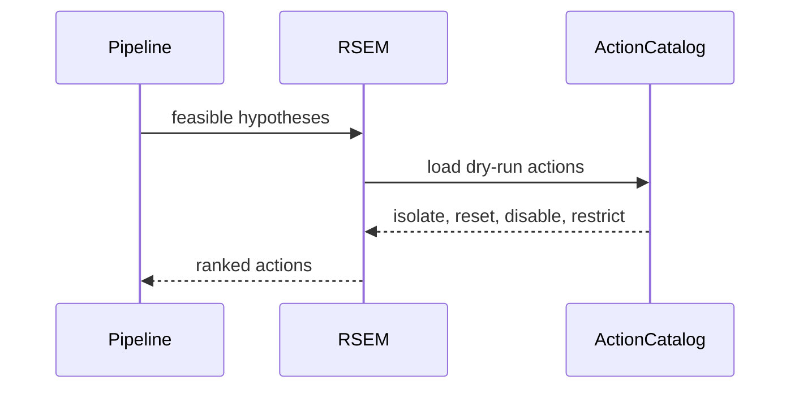

# S06 RSEM Layer

## Goal

Rank defensive actions using the paper-style containment and business-impact score.

## SSD

## Input

- Incident.
- Feasibility results.

## Output

- Ranked actions using:
  `score = 0.7 * containment - 0.3 * business_impact`.
- Top paper action:
  `Isolate ws-fin-27`, `ISOLATE_HOST`, score `0.599`.

## Code Tasks

- Add deterministic action catalog.
- Tune POC containment/business-impact values so top score rounds to `0.599`.
- Attach viable hypothesis IDs to ranked actions.

## Test Cases

- Top action name and ID match.
- Top score equals `0.599`.
- Ranks are sequential.

## Stress Test

- Ranking many generated action candidates should be deterministic and side-effect free.

## Acceptance

- RSEM is pure computation and does not execute actions.

## Env Needed

- none
