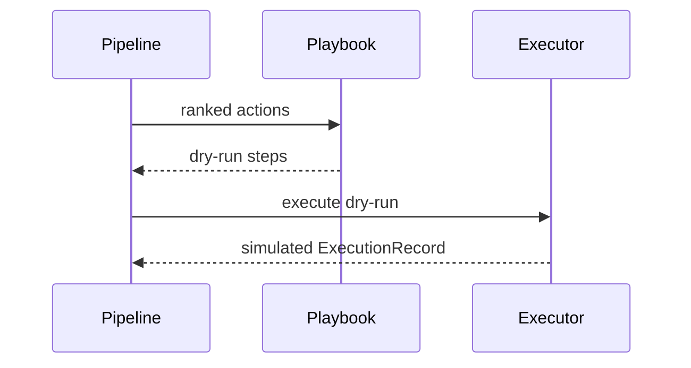

# S07 Playbook Execution

## Goal

Convert ranked actions into a dry-run playbook and simulated execution record.

## SSD

## Input

- Ranked actions from RSEM.
- Incident ID.

## Output

- `Playbook` with top dry-run actions.
- `ExecutionRecord` where every step status is `simulated`.

## Code Tasks

- Implement `PlaybookBuilder`.
- Implement `DryRunExecutor`.
- Reject non-dry-run mode.
- Include approval metadata and rollback metadata in simulated steps.

## Test Cases

- Playbook mode is `dry-run`.
- Execution status is `simulated`.
- First command is `DRY_RUN:ISOLATE_HOST(ws-fin-27)`.

## Stress Test

- Repeated playbook builds must not touch local OS/network/security controls.

## Acceptance

- No production connector exists in this POC.
- Any non-dry-run execution attempt is blocked.

## Env Needed

- none
