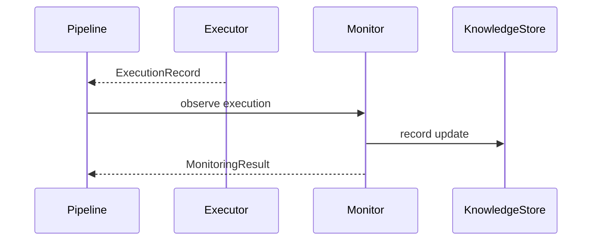

# S08 Monitoring Closed Loop

## Goal

Record execution observations and update the in-memory knowledge store.

## SSD

## Input

- Incident.
- Execution record.
- Knowledge store.

## Output

- `MonitoringResult` with status `stable` for normal dry-run.
- Knowledge update entry recorded in memory.

## Code Tasks

- Detect non-dry-run deviation.
- Count observed steps.
- Record audit-friendly knowledge update.

## Test Cases

- E2E pipeline writes monitoring artifact.
- Dry-run execution has no deviations.
- Store receives one monitoring update.

## Stress Test

- Repeated mock runs append bounded, simple in-memory updates.

## Acceptance

- Monitoring is observable through `monitoring.json` and `cycle_result.json`.

## Env Needed

- none
