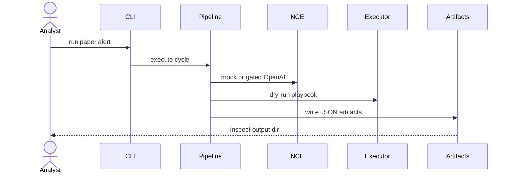

# S09 E2E Benchmark Hardening

## Goal

Wire the full POC, CLI, artifacts, and mock-only high-volume benchmark guard.

## SSD

## Input

- `fixtures/paper_alert.json`
- `fixtures/lanl_sample.csv`
- Optional `OPENAI_API_KEY` for small `run` or `pytest -m llm`.

## Output

- Full artifact directory:
  `incident.json`, `hypotheses.json`, `feasibility.json`, `ranked_actions.json`,
  `playbook.json`, `execution.json`, `monitoring.json`, `cycle_result.json`.
- Benchmark summary artifact:
  `benchmark_summary.json`.

## Code Tasks

- Implement `AgentSOCPipeline`.
- Implement `agent-soc run`.
- Implement `agent-soc benchmark`.
- Block accidental OpenAI usage in benchmark/stress.
- Add default, LLM, and stress pytest markers.

## Test Cases

- E2E paper run writes all artifacts.
- `cycle_result.json` records mock backend for deterministic run.
- Benchmark with `--llm openai` fails by default.
- LLM test is isolated behind `pytest -m llm`.

## Stress Test

- 5,000 LANL-style synthetic events.
- Concurrency parameter 1/8/32 is accepted and recorded.
- All high-volume paths use mock unless guard is deliberately overridden and still under call budget.

## Acceptance

- Default command `pytest -m "not llm and not stress"` passes without OpenAI.
- `pytest -m stress` is mock-only.
- `pytest -m llm` is the only test path that may spend OpenAI API tokens.

## Env Needed

- `OPENAI_API_KEY` only for `pytest -m llm` or small `run --llm openai`.
