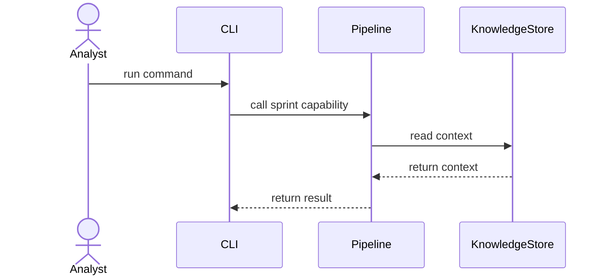

# Sprint Template

## Goal

State the concrete outcome for this sprint.

## SSD

## Input

- Required files, command arguments, env vars, fixtures, or test data.

## Output

- Files, JSON contracts, CLI output, or test-visible behavior.

## Code Tasks

- Implementation tasks.

## Test Cases

- Unit and integration tests.

## Stress Test

- High-volume, malformed, concurrency, timeout, or safety checks.

## Acceptance

- Exact conditions that mean this sprint is done.

## Env Needed

- Env vars required to run real external services. Use `none` when no real env is needed.
